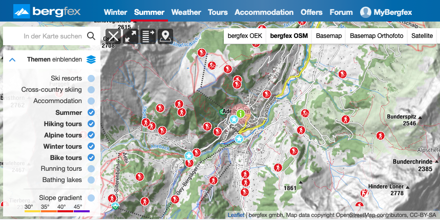
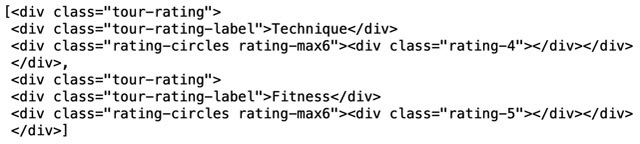
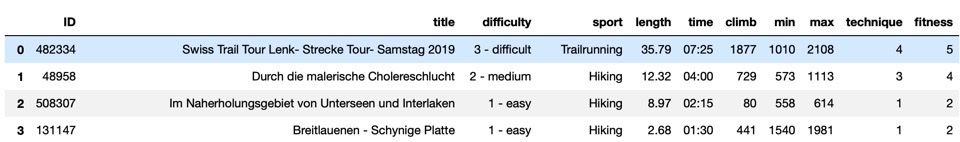
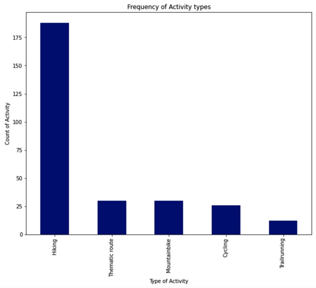
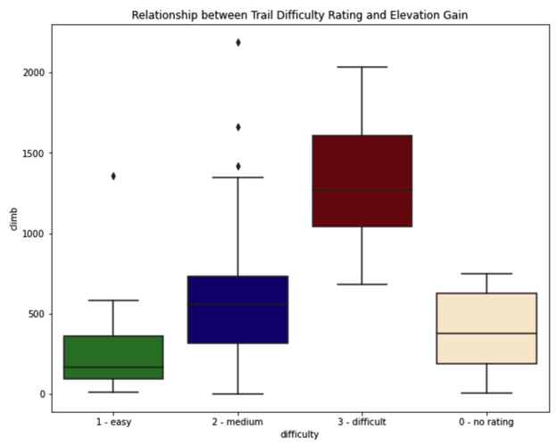
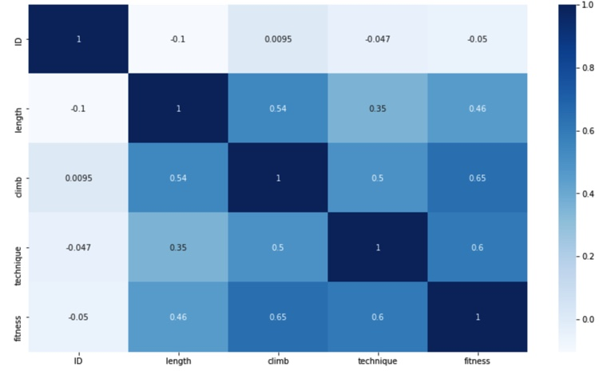

# Webscraping with spatial data - Bergfex

This repository documents the webscraping of Bergfex webpage adding snow level information to each activity. It was elaborated by Malwina San José, Tiffany Carruthers and Sarah Dutschke. The information presented here is not approved for any kind of commercial use.

Project Team
-----------

[Sarah Dutschke](https://www.linkedin.com/in/sarah-dutschke/), 
[Malwina San José](https://www.linkedin.com/in/malwina-san-josé/),
[Tiffany Carruthers](https://www.linkedin.com/in/tiffanycarruthers/)

Partners
 -------
[Bergex](https://www.bergfex.com/) is a company that provides a wide range of information about mountains (such as mountain activities, weather information, accommodation options etc.).

Project description
-------------------
Planning hikes in winter time can be complicated in Switzerland. Sometimes hiking in the snow is an exciting adventure, but it can also be an unexpected surprise. There is no shortage of trail databases that contain information about how long or how difficult a trail is, however finding up to date information about snowfall data on these trails can be tedious. This notebook solves the snowline problem by scraping GPX data from bergfex.com and meteocentrale.ch. 

Weather GPS data is obtained from multiple weather towers across Switzerland that publicly provide current weather data. Since these towers are located in a specific latitude and longitude, an approximate chance of snowfall was assumed based on the distance from the tower and altitude. If a trail is within a certain distance from a tower, and is also at a certain altitude then it will be tagged with a snow alert. This was implemented by finding the closest hiking trails to a tower that has reported snow.

A dashboard to visualize and select specific activities is created with Tableau in our [next project](https://github.com/SarahDutschke/bergfex_snowalert_part_II).

Project Milestones
-------------------
### Milestone 1
Scraping the Bergfex.com website in order to create Pandas dataframes that contain important information about each trail. This code uses BeautifulSoup to parse the html tags into json, which is easier to work with. A for-loop iterates over each html tag and adds the corresponding information into empty lists. Data is cleaned and an initial data analysis is performed.
Finally, also the corresponding GPS data is downloaded and scraped.
The functions created in this notebook allow to easily repeat the steps or perform them for different regions.

 ### Milestone 2
 Scraping the snow level data from meteocentrale.ch website in order to create Pandas dataframes that contain the snow level for 91 weather stations around Switzerland.
 This code uses BeautifulSoup to parse the html tags. A for-loop iterates over each html tag and adds the corresponding information into empty lists. Afterwards the data is cleaned.
 Finally, we add the GPS coordinates of each weather station.
 
 ### Milestone 3
 In this part our aim is to find the nearest known snow level for our activities and to create a "snow alert" if necessary. Therefore, we use the files from Milestones 1 & 2 and compare the GPS coordinates. 
 We then classify based on two conditions if a snow alert exists and add the 'snow status' to each activity.
 
 
 Outcomes
 ---------
As the final outcome of this project, we created three jupyter notebooks (one for each Milestone). With the help of these, we create a data base of 3'000+ activities in Switzerland, for each one indicating if there is a 'snow alert'. 

Examples
---------

Requirements
------------
The libraries required to run this product are the following (details in environment.yml and environment2.yml):
  - ipykernel
  - pandas

XXX to update
  
  
Repository Structure
------------
    ├── README.md       <- top-level README file for anybody interested in this project
    ├── notebooks       <- one notebook for each Milestone
    ├── data            <- csv files, created based on each of the notebooks
    ├── gpx_files       <- gpx files for each activity, created based on notebook I
    ├── environment.yml <- environment file that lists the channels and dependencies needed for this project
    ├── environment2.yml <- detailed environment file that contains specific versions used for this project
